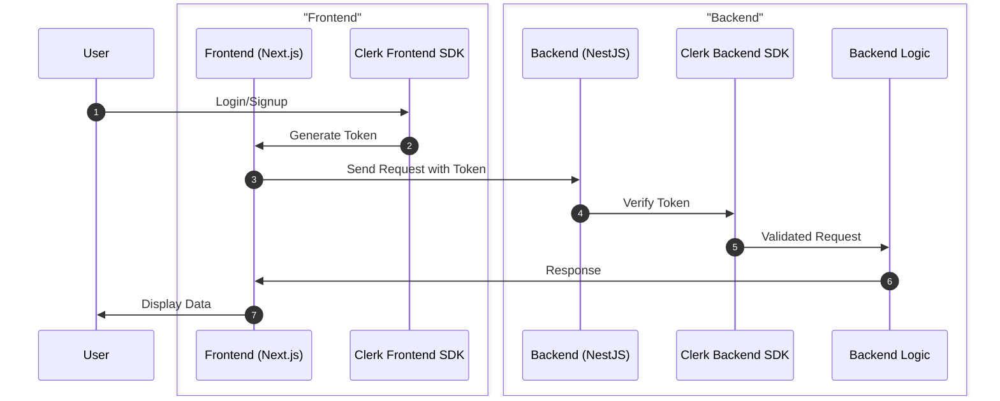
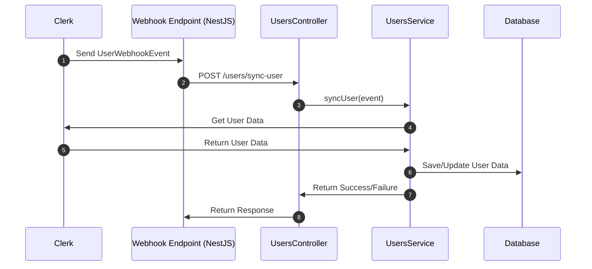
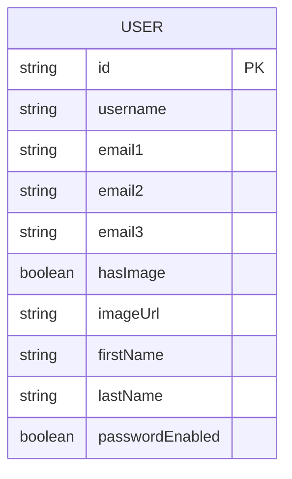

# 🚀 Full-Stack Boilerplate with Next.js, NestJS, PostgreSQL, and NGINX

| Section                                                       | Content                                                                                                                                                                                                                                                                                                                                |
| ------------------------------------------------------------- | -------------------------------------------------------------------------------------------------------------------------------------------------------------------------------------------------------------------------------------------------------------------------------------------------------------------------------------- |
| 1. [Introduction](#1-introduction)                            | • [Key Features](#key-features-)                                                                                                                                                                                                                                                                                                       |
| 2. [Technology Stack](#2-technology-stack-)                   |                                                                                                                                                                                                                                                                                                                                        |
| 3. [Getting Started](#3-getting-started-)                     | • [3.1 Prerequisites](#31-prerequisites)<br>• [3.2 Setup Methods](#32-setup-methods)<br>&nbsp;&nbsp;&nbsp;&nbsp;◦ [3.2.1 Using the Setup Script](#321-using-the-setup-script)<br>&nbsp;&nbsp;&nbsp;&nbsp;◦ [3.2.2 Manual Setup](#322-manual-setup)<br>• [3.3 Postman/Insomnia Setup](#33-postmaninsomnia-setup-with-clerk-for-testing) |
| 4. [Authentication with Clerk](#4-authentication-with-clerk-) | • [4.1 Authentication Flow](#41-authentication-flow)<br>• [4.2 User Synchronization with Clerk Webhooks](#42-user-synchronization-with-clerk-webhooks)<br>&nbsp;&nbsp;&nbsp;&nbsp;◦ [4.2.1 User Synchronization Flow](#421-user-synchronization-flow)<br>&nbsp;&nbsp;&nbsp;&nbsp;◦ [4.2.2 How It Works](#422-how-it-works)             |
| 5. [Access the Application](#5-access-the-application-)       |                                                                                                                                                                                                                                                                                                                                        |
| 6. [Warnings](#6-warnings-)                                   |                                                                                                                                                                                                                                                                                                                                        |
| 7. [Tips](#7-tips-)                                           |                                                                                                                                                                                                                                                                                                                                        |
| 8. [Contribution Guidelines](#8-contribution-guidelines-)     | • [Getting Started](#getting-started)<br>• [Making Changes](#making-changes)<br>• [Submitting a Pull Request](#submitting-a-pull-request)<br>• [Code Quality and Reviews](#code-quality-and-reviews)<br>• [Getting Help](#getting-help)                                                                                                |
| 9. [Star the Repository](#9-star-the-repository-)             |                                                                                                                                                                                                                                                                                                                                        |

## 1. Introduction

Welcome to your Full-Stack Boilerplate! This project provides a seamless integration of modern web technologies, including Next.js for the frontend, NestJS for the backend, PostgreSQL for the database, and NGINX for reverse proxying. Perfect for getting your next big idea off the ground quickly!

### Key Features 🌟

- **Modern Tech Stack:** Leverages cutting-edge technologies like Next.js 14, NestJS, and TypeScript for a scalable and maintainable architecture.
- **Seamless Integration:** Preconfigured to work seamlessly together, allowing you to focus on building your application logic.
- **Developer Experience:** Includes developer tools like pgAdmin for database management and automatic setup scripts for convenience.
- **Production Ready:** Uses NGINX for reverse proxying, setting a solid foundation for deploying to production.
- **Customizable:** Easily adapt the boilerplate to fit your project's unique requirements.
- **Secure Authentication:** Implements Clerk for secure user management and authentication.

## 2. Technology Stack 🛠️

| Area         | Technology                                                                                      | Purpose                                           |
| ------------ | ----------------------------------------------------------------------------------------------- | ------------------------------------------------- |
| **Frontend** | Next.js 14, TypeScript, Tailwind CSS, ShadcnUI, Radix UI, lucide-react, Zod, Clerk, next-themes | Building a modern, responsive, and interactive UI |
| **Backend**  | NestJS, TypeScript, TypeORM, Clerk SDK Node                                                     | Crafting a robust, scalable, and efficient API    |
| **Database** | PostgreSQL                                                                                      | Storing and managing application data             |
| **DevOps**   | NGINX, Docker                                                                                   | Containerization and reverse proxying             |

## 3. Getting Started 🚀

Follow these steps to get the project up and running on your local machine.

### 3.1 Prerequisites

Make sure you have the following installed:

- Clerk Account (for authentication/authorization/webhooks)
- Ngrok CLI and Account (for tunneling in development)
- Certbot CLI (for SSL certificates)
- Docker & Docker Compose (for containerization)
- Node.js (optional, for running services outside Docker)
- Postman (optional, for API testing)

### 3.2 Setup Methods

#### 3.2.1 Using the Setup Script

1. **Clone the repository**

   ```sh
   git clone git@github.com:ahamedzoha/modern-fullstack-bolerplate.git
   cd modern-fullstack-bolerplate
   ```

2. **Run the setup script**

   ```sh
    ./setup.sh
   ```

   The script will guide you through the following steps:

   - Checking prerequisites
   - Gathering user input for custom domain, ngrok auth token, Clerk keys, etc.
   - Optionally generating SSL certificates with Certbot
   - Creating necessary `.env` files
   - Creating NGINX configuration
   - Building and starting the services with Docker Compose
   - Creating an `ngrok.yml` file for tunneling
   - Starting the tunnel with Ngrok

   After successful setup, an `ngrok.yml` will be created with the tunneling configuration based on your `env` variables and the services will be started immediately.

3. **Start ngrok for public access** (optional) - manually start the ngrok tunnel using the following command:

   This command will create a ngrok.yml file with the tunneling configuration based on your env variables and start the tunnel.

   ```sh
   ./start_ngrok.sh
   ```

   This will create a public URL that you can use to access your application from anywhere.

#### 3.2.2 Manual Setup

1.  **Clone the repository**

    ```sh
    git clone git@github.com:ahamedzoha/modern-fullstack-bolerplate.git

    cd modern-fullstack-bolerplate
    ```

2.  **Configure Environment Variables**

    You need to add the environment files in 3 different locations:

    - Create a `.env` file in the root directory with the following content:

      ```env
      POSTGRES_USER=your_local_db_user
      POSTGRES_PASSWORD=your_local_db_password
      POSTGRES_DB=your_local_db_name
      PGADMIN_DEFAULT_EMAIL=your_email@example.com
      PGADMIN_DEFAULT_PASSWORD=your_pgadmin_password
      NGROK_AUTH_TOKEN=xxxxxxxxxxxxxxxxxxxxxxxx
      NGROK_DOMAIN=man-xyz.ngrok-free.app
      NGROK_HOST_HEADER=xyz.ngrok-free.app
      ```

    - Create a `.env.local` file in the `fe` directory:

      ```env
      NEXT_PUBLIC_CLERK_PUBLISHABLE_KEY=xxxxxxxxxxxxxxxxxxxxxxxxxx
      CLERK_SECRET_KEY=xxxxxxxxxxxxxxxxxxxxxxxxxxxxx
      NEXT_PUBLIC_CLERK_SIGN_IN_URL=/sign-in
      NEXT_PUBLIC_CLERK_SIGN_UP_URL=/sign-up
      NEXT_PUBLIC_CLERK_SIGN_IN_FALLBACK_REDIRECT_URL=/dashboard
      # Update the following with your ngrok domain or public domain where the backend service is available
      NEXT_PUBLIC_API_BASE_URL=http://nest_app:3001/api
      ```

    - Create a `.env` file in the `be` directory:

      ```env
        CLERK_SECRET_KEY=xxxxxxxxxxxxxxxxxxxxx
        DB_HOST=postgres
        DB_PORT=5432
        DB_USERNAME=your_local_db_user
        DB_PASSWORD=your_local_db_password
        DB_NAME=your_local_db_name
      ```

3.  **Build and Start the Services**

    ```sh
    docker-compose up --build
    ```

    This command will build and start the backend, frontend, PostgreSQL, pgAdmin, and NGINX services.

4.  **Start ngrok for public access** (optional) - manually start the ngrok tunnel using the following command:

    This command will create a ngrok.yml file with the tunneling configuration based on your env variables and start the tunnel.

    ```sh
    ./start_ngrok.sh
    ```

### 3.3 Postman/Insomnia Setup with Clerk for testing

Please follow the URL for the postman setup with Clerk for testing the API.[Postman or Insomnia in Testing](https://clerk.com/docs/testing/postman-or-insomnia)

Here you will be guided on how to create a long-lived token for testing the API endpoints that are protected by the `ClerkAuthGuardGuard`.

## 4. Authentication with Clerk 🛡️

This boilerplate uses **Clerk** for authentication, ensuring a seamless and secure user management experience.

- **Frontend**: Authentication is handled by Clerk's React components and hooks.

- **Backend**: Requests are authenticated using Clerk's SDK and cookie parser, ensuring secure and verified communication between frontend and backend.

### 4.1 Authentication Flow



### 4.2 User Synchronization with Clerk Webhooks

** Please make sure to set up Clerk webhooks and configure the webhook endpoint in the Clerk dashboard. For example, https://`your-public-domain`/api/users/sync-user. **

This project uses Clerk webhooks to synchronize user data with the database. When a user is created, updated, or deleted in Clerk, a webhook event is sent to the backend, which processes the event and updates the database accordingly.

#### 4.2.1 User Synchronization Flow

The following sequence diagram illustrates the flow of user data from Clerk webhooks to the database:



The following ERD shows the structure of the `User` entity in the database:



#### 4.2.2 How It Works

1. Webhook Event: Clerk sends a UserWebhookEvent to the `/users/sync-user` endpoint.
2. Controller: The `UsersController` receives the event and calls the `syncUser` method in the `UsersService`.
3. Service: The `UsersService` processes the event:
   For `user.created` and `user.updated` events, it fetches the user data from Clerk and saves/updates it in the database.
   For `user.deleted` events, it deletes the user from the database.
4. Database: The user data is saved, updated, or deleted in the database.

   This setup ensures that your database is always in sync with the user data in Clerk.

### 5. Access the Application 🌐

- **Frontend**: http://localhost:3000 or http://`your-public-domain.com`
- **Backend**: http://localhost:3001 or http://`your-public-domain.com`/api
- **pgAdmin**: http://localhost:5050

## 6. Warnings ⚠️

- **Database Synchronization**: The backend is configured to synchronize the database schema on startup. **Do not use this in production** as it may lead to data loss.
- **Environment Variables**: Make sure all environment variables are correctly set in the `.env` files.
- **Port Conflicts**: Ensure the ports specified in the `docker-compose.yml` are not in use by other applications.
- **Data Persistence**: Data in PostgreSQL is persisted using Docker volumes. Make sure to back up the volumes if necessary.

## 7. Tips 💡

- **Development**: For a smoother development experience, you can run `docker-compose up` without the `--build` flag to start the services without rebuilding the images.
- **Production**: Consider using Docker Compose override files (`docker-compose.override.yml`) to adjust settings for different environments (dev, staging, production).
- **Scaling**: For larger applications, consider using Kubernetes for orchestration.

## 8. Contribution Guidelines 🤝

I am thrilled that you're interested in contributing to this project! This guide will help you get started with the contribution process.

### Getting Started

1. **Fork the Repository**:

   - Visit the [Modern Full-Stack Boilerplate repository](https://github.com/ahamedzoha/modern-fullstack-bolerplate) on GitHub.
   - Click the "Fork" button in the top-right corner to create your own copy of the repository.

2. **Clone Your Fork**:
   ```sh
   git clone https://github.com/your-username/modern-fullstack-bolerplate.git
   cd modern-fullstack-bolerplate
   ```
3. **Add the Upstream Remote**:

   ```sh
   git remote add upstream https://github.com/ahamedzoha/modern-fullstack-bolerplate.git
   ```

4. **Setup Development Environment**:
   - Install the necessary dependencies and accounts by following the Setup Methods in the README.

### Making Changes

1. **Create a New Branch**:
   Create a new branch for your changes:

   ```sh
   git checkout -b feature/your-feature-name
   ```

2. **Make Your Changes**:

   - Make the necessary changes in your branch.

3. **Commit Your Changes**:

   - Stage and commit your changes with a descriptive message:

   ```sh
   git add .
   git commit -m "Add a descriptive commit message"
   ```

4. **Push Your Changes**:

   - Push your changes to your fork:

   ```sh
   git push origin feature/your-feature-name
   ```

### Submitting a Pull Request

1. **Create a Pull Request**:
   - Go to your fork on GitHub.
   - Click "New Pull Request".
   - Select your branch and provide a clear title and description.
   - Fill out the Pull Request Template:
     - Describe the changes you've made.
     - Reference any related issues.
     - Check all items in the PR checklist.

### Code Quality and Reviews

- **Code Quality**:

  - Ensure your code follows the project's coding standards and guidelines.
  - Write clear, concise, and meaningful commit messages.

- **Tests and Documentation**:

  - If applicable, write tests for your changes.
  - Update or add documentation as necessary.

- **Review Process**:
  - Be responsive to feedback during the code review process.
  - Make necessary changes and updates as requested by the reviewers.

### Getting Help

- **Need Help?**:
  - If you have any questions or need help, feel free to open an issue or contact the maintainers.

## 9. Star the Repository ⭐️⭐️⭐️

If you find this project helpful, please give it a ⭐️ on [GitHub](https://github.com/ahamedzoha/modern-fullstack-bolerplate)! Your support is greatly appreciated. 🙏

---
