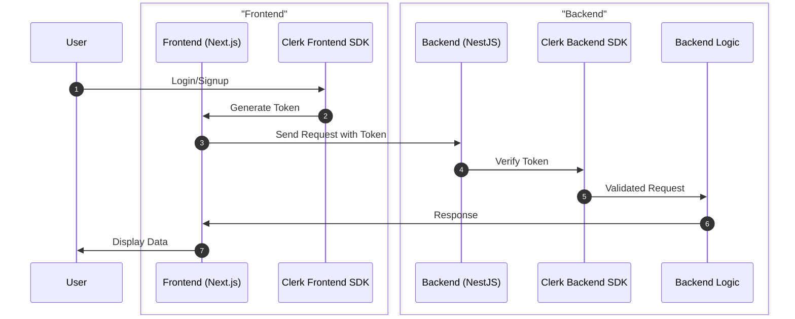

# 🚀 Full-Stack Boilerplate with Next.js, NestJS, PostgreSQL, and NGINX

Welcome to your Full-Stack Boilerplate! This project provides a seamless integration of modern web technologies, including Next.js for the frontend, NestJS for the backend, PostgreSQL for the database, and NGINX for reverse proxying. Perfect for getting your next big idea off the ground quickly!

## 🌟 Key Features

- **Modern Tech Stack:** Leverages cutting-edge technologies like Next.js 14, NestJS, and TypeScript for a scalable and maintainable architecture.
- **Seamless Integration:** Preconfigured to work seamlessly together, allowing you to focus on building your application logic.
- **Developer Experience:** Includes developer tools like pgAdmin for database management and automatic setup scripts for convenience.
- **Production Ready:** Uses NGINX for reverse proxying, setting a solid foundation for deploying to production.
- **Customizable:** Easily adapt the boilerplate to fit your project's unique requirements.
- **Secure Authentication:** Implements Clerk for secure user management and authentication.

## 🛠️ Technologies

| Area         | Technology                                                                                      | Purpose                                           |
| ------------ | ----------------------------------------------------------------------------------------------- | ------------------------------------------------- |
| **Frontend** | Next.js 14, TypeScript, Tailwind CSS, ShadcnUI, Radix UI, lucide-react, Zod, Clerk, next-themes | Building a modern, responsive, and interactive UI |
| **Backend**  | NestJS, TypeScript, TypeORM, Clerk SDK Node                                                     | Crafting a robust, scalable, and efficient API    |
| **Database** | PostgreSQL                                                                                      | Storing and managing application data             |
| **DevOps**   | NGINX, Docker                                                                                   | Containerization and reverse proxying             |

## 🚀 Getting Started

Follow these steps to get the project up and running on your local machine.

### Prerequisites

Make sure you have the following installed:

- Docker & Docker Compose
- Node.js (optional, for running services outside Docker)
- Ngrok (optional, for tunneling)
- Certbot (optional, for SSL certificates)

### Setup

#### Method 1: Using the Setup Script

1. **Clone the repository**

   ```sh
   git clone git@github.com:ahamedzoha/modern-fullstack-bolerplate.git
   cd modern-fullstack-bolerplate
   ```

2. **Run the setup script**

   ```sh
   ./setup.sh
   ```

   The script will guide you through the following steps:

   - Checking prerequisites
   - Gathering user input for custom domain, ngrok auth token, Clerk keys, etc.
   - Optionally generating SSL certificates with Certbot
   - Creating necessary `.env` files
   - Creating NGINX configuration
   - Building and starting the services with Docker Compose
   - Creating an `ngrok.yml` file for tunneling
   - Starting the tunnel with Ngrok

   This script will guide you through setting up the environment variables and starting the services.
   After successful setup, an `ngrok.yml` will be created with the tunneling configuration based on your `env` variables and the services will be started immediately.

3. **Start ngrok for public access** (optional) - manually start the ngrok tunnel using the following command:

   This command will create a ngrok.yml file with the tunneling configuration based on your env variables and start the tunnel.

   ```sh
   ./start_ngrok.sh
   ```

This will create a public URL that you can use to access your application from anywhere.

#### Method 2: Manual Setup

1.  **Clone the repository**

    ```sh
    git clone git@github.com:ahamedzoha/modern-fullstack-bolerplate.git
    cd modern-fullstack-bolerplate
    ```

2.  **Configure Environment Variables**
    You need to add the environment files in 3 different locations:

    - Create a `.env` file in the root directory with the following content:

      ```env
      POSTGRES_USER=your_local_db_user
      POSTGRES_PASSWORD=your_local_db_password
      POSTGRES_DB=your_local_db_name
      PGADMIN_DEFAULT_EMAIL=your_email@example.com
      PGADMIN_DEFAULT_PASSWORD=your_pgadmin_password
      NGROK_AUTH_TOKEN=xxxxxxxxxxxxxxxxxxxxxxxx
      NGROK_DOMAIN=man-xyz.ngrok-free.app
      NGROK_HOST_HEADER=xyz.ngrok-free.app
      ```

    - Create a `.env.local` file in the `fe` directory:

      ```env
      NEXT_PUBLIC_CLERK_PUBLISHABLE_KEY=xxxxxxxxxxxxxxxxxxxxxxxxxx
      CLERK_SECRET_KEY=xxxxxxxxxxxxxxxxxxxxxxxxxxxxx
      NEXT_PUBLIC_CLERK_SIGN_IN_URL=/sign-in
      NEXT_PUBLIC_CLERK_SIGN_UP_URL=/sign-up
      NEXT_PUBLIC_CLERK_SIGN_IN_FALLBACK_REDIRECT_URL=/dashboard

      NEXT_PUBLIC_API_BASE_URL=/api
      ```

    - Create a `.env` file in the `be` directory:

      ```env
      CLERK_SECRET_KEY=xxxxxxxxxxxxxxxxxxxxx
      DB_HOST=postgres
      DB_PORT=5432
      DB_USERNAME=your_local_db_user
      DB_PASSWORD=your_local_db_password
      DB_NAME=your_local_db_name
      ```

3.  **Build and Start the Services**

    ```sh
    docker-compose up --build
    ```

    This command will build and start the backend, frontend, PostgreSQL, pgAdmin, and NGINX services.

4.  **Start ngrok for public access** (optional) - manually start the ngrok tunnel using the following command:

    This command will create a ngrok.yml file with the tunneling configuration based on your env variables and start the tunnel.

    ```sh
    ./start_ngrok.sh
    ```

## 🔐 Authentication with Clerk

This boilerplate uses **Clerk** for authentication, ensuring a seamless and secure user management experience.

- **Frontend**: Authentication is handled by Clerk's React components and hooks.
- **Backend**: Requests are authenticated using Clerk's SDK and cookie parser, ensuring secure and verified communication between frontend and backend.

### Authentication Flow



### Access the Application

- **Frontend**: http://localhost
- **Backend**: http://localhost/api
- **pgAdmin**: http://localhost:5050

## ⚠️ Warnings and Tips

- **Database Synchronization**: The backend is configured to synchronize the database schema on startup. **Do not use this in production** as it may lead to data loss.
- **Environment Variables**: Make sure all environment variables are correctly set in the `.env` files.
- **Port Conflicts**: Ensure the ports specified in the `docker-compose.yml` are not in use by other applications.
- **Data Persistence**: Data in PostgreSQL is persisted using Docker volumes. Make sure to back up the volumes if necessary.

## 💡 Tips

- **Development**: For a smoother development experience, you can run `docker-compose up` without the `--build` flag to start the services without rebuilding the images.
- **Production**: Consider using Docker Compose override files (`docker-compose.override.yml`) to adjust settings for different environments (dev, staging, production).
- **Scaling**: For larger applications, consider using Kubernetes for orchestration.

## 🌟 Star the Repository

If you find this project helpful, please give it a ⭐️ on [GitHub](https://github.com/ahamedzoha/modern-fullstack-bolerplate)! Your support is greatly appreciated.

---

Happy coding! 🎉

For any issues or contributions, feel free to open a pull request or issue on the [GitHub repository](https://github.com/ahamedzoha/modern-fullstack-bolerplate).
