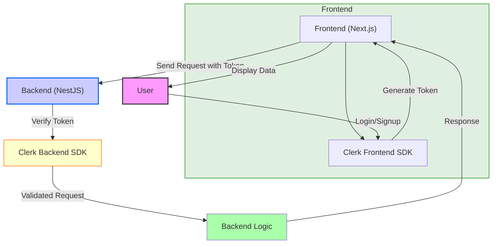

# 🚀 Full-Stack Boilerplate with Next.js, NestJS, PostgreSQL, and NGINX

Welcome to your Full-Stack Boilerplate! This project provides a seamless integration of modern web technologies, including Next.js for the frontend, NestJS for the backend, PostgreSQL for the database, and NGINX for reverse proxying. Perfect for getting your next big idea off the ground quickly!

## 🌟 Technologies Used

### Frontend (FE)

- **[Next.js 14.2.4](https://nextjs.org/)**: The React framework for production.
- **[TypeScript](https://www.typescriptlang.org/)**: Typed JavaScript at Any Scale.
- **[Tailwind CSS](https://tailwindcss.com/)**: A utility-first CSS framework for rapid UI development.
- **[ShadcnUI](https://shadcn.dev/)**: A customizable component library.
- **[Radix UI](https://www.radix-ui.com/)**: Unstyled, accessible components for building high-quality web applications.
- **[lucide-react](https://lucide.dev/docs/lucide-react)**: Beautiful & consistent icon toolkit.
- **[Zod](https://zod.dev/)**: TypeScript-first schema declaration and validation library.
- **[Clerk](https://clerk.dev/)**: Complete user management solution for authentication.
- **[next-themes](https://github.com/pacocoursey/next-themes)**: An abstraction for themes in Next.js.

### Backend (BE)

- **[NestJS](https://nestjs.com/)**: A progressive Node.js framework for building efficient, reliable, and scalable server-side applications.
- **[Clerk SDK Node](https://clerk.dev/docs/node)**: Clerk SDK for integrating authentication and user management.
- **[TypeScript](https://www.typescriptlang.org/)**: Typed JavaScript at Any Scale.
- **[TypeORM](https://typeorm.io/)**: ORM for TypeScript and JavaScript (ES7, ES6, ES5).

### Additional Technologies

- **[PostgreSQL](https://www.postgresql.org/)**: The world’s most advanced open-source relational database.
- **[NGINX](https://www.nginx.com/)**: High-performance HTTP server, reverse proxy, and IMAP/POP3 proxy server.
- **[Docker](https://www.docker.com/)**: Platform to develop, ship, and run applications in containers.

## 🚀 Getting Started

Follow these steps to get the project up and running on your local machine.

### Prerequisites

Make sure you have the following installed:

- Docker & Docker Compose
- Node.js (if you want to run the services outside of Docker)

### Setup

1. **Clone the repository**

   ```sh
   git clone https://github.com/ahamedzoha/modern-fullstack-bolerplate.git
   cd modern-fullstack-bolerplate
   ```

2. **Configure Environment Variables**

   - Create a `.env` file in the root directory with the following content:

     ```env
     POSTGRES_USER=your_local_db_user
     POSTGRES_PASSWORD=your_local_db_password
     POSTGRES_DB=your_local_db_name
     PGADMIN_DEFAULT_EMAIL=your_email@example.com
     PGADMIN_DEFAULT_PASSWORD=your_pgadmin_password
     ```

   - Create a `.env.local` file in the `fe` directory:

     ```env
     NEXT_PUBLIC_CLERK_PUBLISHABLE_KEY=**YOUR_CLERK_PUBLISHABLE_KEY**
     CLERK_SECRET_KEY=**YOUR_CLERK_SECRET_KEY**

     NEXT_PUBLIC_CLERK_SIGN_IN_URL=/sign-in
     NEXT_PUBLIC_CLERK_SIGN_UP_URL=/sign-up
     NEXT_PUBLIC_CLERK_SIGN_IN_FALLBACK_REDIRECT_URL=/dashboard

     NEXT_PUBLIC_API_BASE_URL=/api
     ```

   - Create a `.env` file in the `be` directory:

     ```env
     CLERK_SECRET_KEY=**YOUR_CLERK_SECRET_KEY**

     DB_HOST=postgres
     DB_PORT=5432
     DB_USERNAME=your_local_db_user
     DB_PASSWORD=your_local_db_password
     DB_NAME=your_local_db_name
     ```

3. **Build and Start the Services**

   ```sh
   docker-compose up --build
   ```

   This command will build and start the backend, frontend, PostgreSQL, pgAdmin, and NGINX services.

### Access the Application

- **Frontend**: http://localhost
- **Backend**: http://localhost/api
- **pgAdmin**: http://localhost:5050

## ⚠️ Warnings and Tips

- **Database Synchronization**: The backend is configured to synchronize the database schema on startup. **Do not use this in production** as it may lead to data loss.
- **Environment Variables**: Make sure all environment variables are correctly set in the `.env` files.
- **Port Conflicts**: Ensure the ports specified in the `docker-compose.yml` are not in use by other applications.
- **Data Persistence**: Data in PostgreSQL is persisted using Docker volumes. Make sure to back up the volumes if necessary.

## 💡 Tips

- **Development**: For a smoother development experience, you can run `docker-compose up` without the `--build` flag to start the services without rebuilding the images.
- **Production**: Consider using Docker Compose override files (`docker-compose.override.yml`) to adjust settings for different environments (dev, staging, production).
- **Scaling**: For larger applications, consider using Kubernetes for orchestration.

## 🔐 Authentication with Clerk

This boilerplate uses **Clerk** for authentication, ensuring a seamless and secure user management experience.

- **Frontend**: Authentication is handled by Clerk's React components and hooks.
- **Backend**: Requests are authenticated using Clerk's SDK and cookie parser, ensuring secure and verified communication between frontend and backend.

### Authentication Flow



## 🌟 Star the Repository

If you find this project helpful, please give it a ⭐️ on [GitHub](https://github.com/ahamedzoha/modern-fullstack-bolerplate)! Your support is greatly appreciated.

---

Happy coding! 🎉

For any issues or contributions, feel free to open a pull request or issue on the [GitHub repository](https://github.com/ahamedzoha/modern-fullstack-bolerplate).
